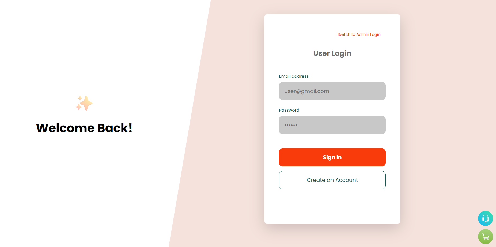
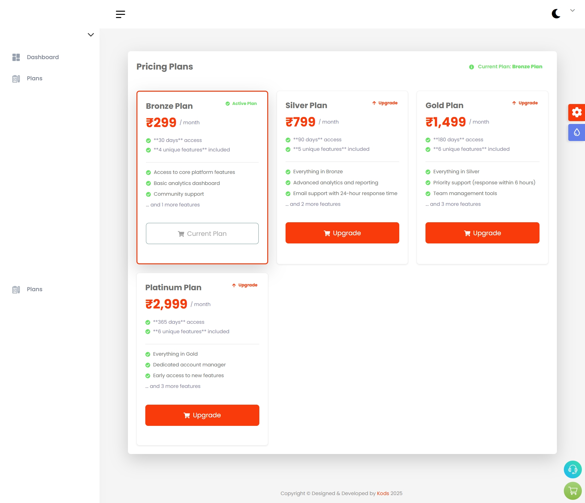
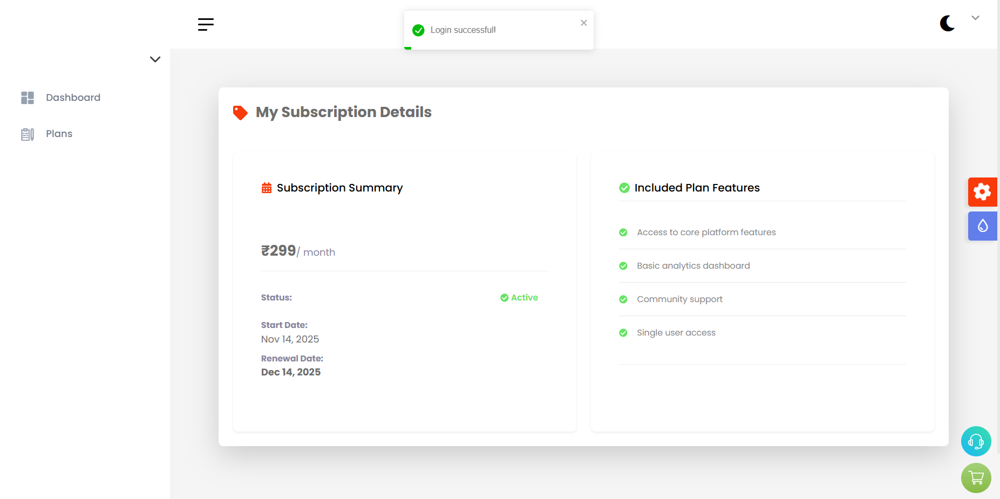
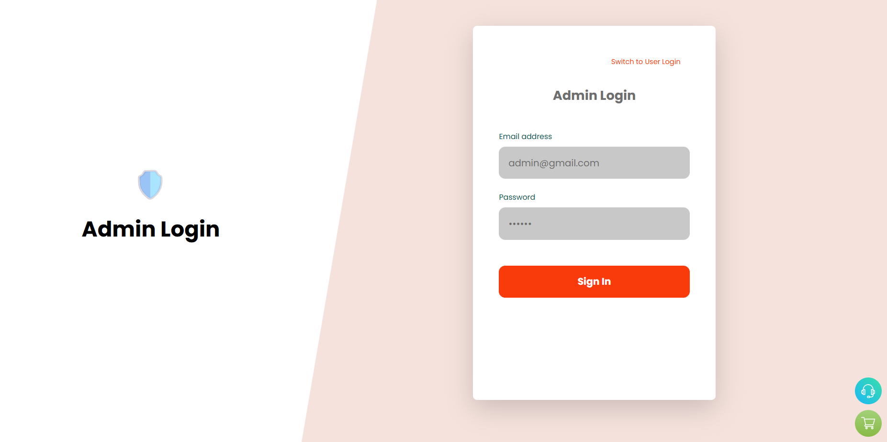
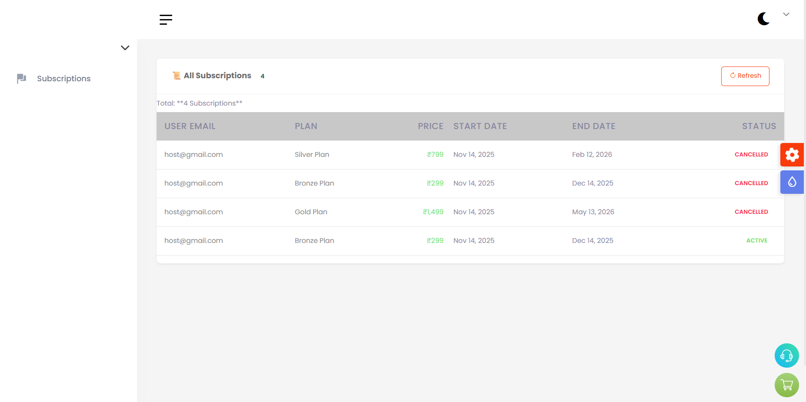

📘 Subscription Management Dashboard – MERN Stack

A full-stack Subscription Management Dashboard built using the MERN stack, featuring user authentication, subscription workflows, admin monitoring, and a clean, modern UI.

This project was developed as part of the Full Stack Web Developer – Technical Assessment (48 hours).

🚀 Features
🔐 Authentication & Authorization

JWT authentication (Access + Refresh tokens)

Role-based access (Admin, User)

📦 Subscription Plans

Browse all available plans
Subscribe to a plan
Upgrade / Downgrade active plan
View current active subscription

🛠 Admin Panel

View all user subscriptions
Track plan status (active / expired)
🔍 Search & Filter
Admin can search subscriptions by **email** or **name** (single field checks both).

🎨 UI & UX

Clean Tailwind CSS design
Responsive layout
Modern dashboard components

📡 API Architecture

RESTful API structure
Global error + response handlers
Request validation with custom validators

🌱 Database Seeding

Auto-seed default Admin
Auto-seed default Subscription Plans

📦 Tech Stack

Frontend
React.js
Tailwind CSS
Axios
React Toastify

Backend
Node.js
Express.js
MongoDB + Mongoose
JWT Auth (Access + Refresh tokens)
Custom middleware + Validators

Tools

Git & GitHub
Postman

Nodemon
📂 Project Structure
subscription-dashboard-task/
│
├── client/               # React frontend (UI + auth + dashboard)
│
└── server/               # Express backend (API + auth + subscriptions)
    ├── src/
    │   ├── controllers/
    │   ├── models/
    │   ├── routes/
    │   ├── seeders/
    │   │   ├── admin.seeder.js
    │   │   └── plan.seeder.js
    │   ├── validations/
    │   ├── utils/
    │   │   ├── ApiError.js
    │   │   ├── ApiResponse.js
    │   │   ├── asyncHandler.js
    │   │   └── multerConfig.js
    │   └── app.js
    │
    ├── package.json
    └── README.md

🛠 Server Setup & Installation
1️⃣ Navigate to the backend
cd server

2️⃣ Install dependencies
npm install

3️⃣ Environment Variables

Create a .env file inside /server:

PORT=8000
MONGO_URI=your_mongodb_connection_string
JWT_SECRET=your_jwt_secret
JWT_REFRESH_SECRET=your_refresh_token_secret

🌱 Database Seeding
Seed default Admin
npm run seed:admin

Seed sample Plans
npm run seed:plans

Available Scripts
"scripts": {
  "start": "node app.js",
  "dev": "nodemon app.js",
  "seed:plans": "node src/seeders/plan.seeder.js",
  "seed:admin": "node src/seeders/admin.seeder.js"
}

▶️ Run the Backend Server
Development
npm run dev

Production
npm start

Backend URL:

http://localhost:8000

🎨 Client Setup (React Frontend)
1️⃣ Navigate to client
cd client

2️⃣ Install dependencies
npm install

3️⃣ Start frontend
npm start

Frontend URL:

http://localhost:3000

📄 Assessment Requirements Implemented
Backend Requirements

✔ JWT login & registration
✔ Access + Refresh token flow
✔ Role-based middleware (admin, user)
✔ CRUD for plans
✔ Subscribe API
✔ Get active subscription
✔ Admin subscription list (with filter)
✔ Joi-style validations
✔ Structured error responses
✔ Seeder for plans & admin

Frontend Requirements

✔ Login page
✔ Register page
✔ Plans page
✔ User dashboard showing current plan
✔ Admin subscription dashboard (with filter)
✔ Protected routes + role check
✔ Global Auth state (Redux)
✔ Clean responsive Tailwind UI
✔ Active/Expired plan indicators
✔ Upgrade/Downgrade logic

Bonus (Optional) – Partially Implemented

Dark mode support (UI-ready)
Plan upgrade/downgrade implemented

🌐 Live Deployment

Frontend (Vercel):
https://subscription-dashboard-task-lovat.vercel.app

Backend (Render):
https://subscription-dashboard-task-d9v6.onrender.com

👨‍💻 Developer

Balagangatharan M
Full Stack Developer

📩 Email: balagangatharan17@gmail.com

📱 Phone: 8778491408
🌍 Bengaluru, India
🔗 GitHub: https://github.com/Bgtbala
🔗 LinkedIn: https://www.linkedin.com/in/balagangatharan17/

<h2>📸 Screenshots</h2>

<h3>User – Login</h3>

  

<h3>User – All Plans</h3>

  

<h3>User – My Plan</h3>

  

<h3>Admin – Login</h3>

  

<h3>Admin – All Subscriptions</h3>

  

